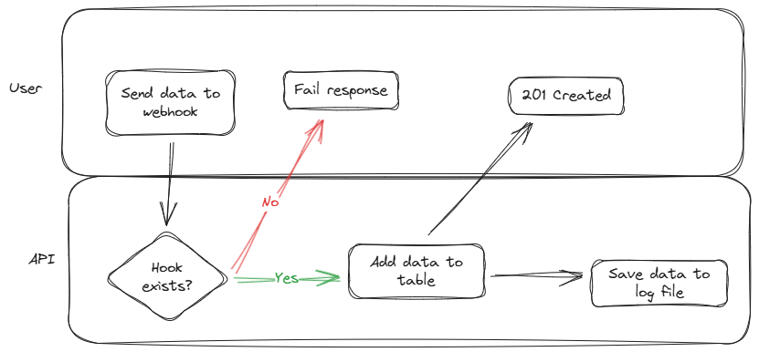

# API / WEBHOOK project

This project provides for three scenarios:
Scenario 1 - a simple lead API requiring users to authenticate using an API key to send leads to the API endpoint


Scenario 2 - retrieve specific lead outcomes using the lead ID and the API key.


Basic UML diagram of the Lead API structure:


Scenario 3 - a webhook endpoint that accepts lead data via POST requests and does a process. In this case, it just logs the data to a file.


Basic UML diagram of the Webhook structure:


## Features

- API endpoint for submitting leads with authentication via API key.
- Webhook endpoint for receiving any data with hook reference.
- Webhook hook management (create, read, update, delete).
- Lead outcome retrieval using lead ID and API key.
- Basic validation and error handling.
- Logging of lead submissions and webhook calls.
- Retrictions on lead retrieval for the original submitter only.

## Technologies Used

- Python
  - FastAPI\*
  - Uvicorn\*
  - Pydantic\*
  - SQLModel
  - alembic (Please note that using SQLModel with alembic can be a bit tricky, but it's possible with some configuration.)
- SQLite
- Docker (optional)

* I've used "fastapi[standard]" which includes these packages and more for development and testing.

## Steps to complete project

1. Design the basic processes and UML diagrams. ✅
2. Set up packages ✅
3. Create database models and migrations. ✅
4. Implement API endpoints for lead submission and retrieval. ✅
5. Implement webhook endpoint and hook management. ✅
6. Add authentication and validation.
7. Test the endpoints using tools like Postman or curl.
8. Add testing and documentation.
9. Containerize

# migrations

To set up database migrations using Alembic with SQLModel, you can follow these steps:

```bash
# add alembic to your project
uv add alembic

# initialize alembic
uv run alembic init alembic
```

Do the adjustments to "alembic.ini", "alembic/script.py.mako" and "alembic/env.py" to work with SQLModel and your database URL. Then you can create and apply migrations as needed:

In the "alembic.ini" file:

Comment out line 89

In the "alembic/script.py.mako" file, add in:

line 13:

```text
import sqlmodel
```

In the "alembic/env.py" file, you need to add the following lines:

line 5-6:

```py
from sqlmodel import SQLModel
import models
```

line 20-21:

```py
database_url = os.getenv("DATABASE_URL", "sqlite:///database.db")
config.set_main_option("sqlalchemy.url", database_url)
```

```bash
# create a new migration
uv run alembic revision --autogenerate -m "create initial tables"

# runs the migrations to update the database schema
uv run alembic upgrade head
```
